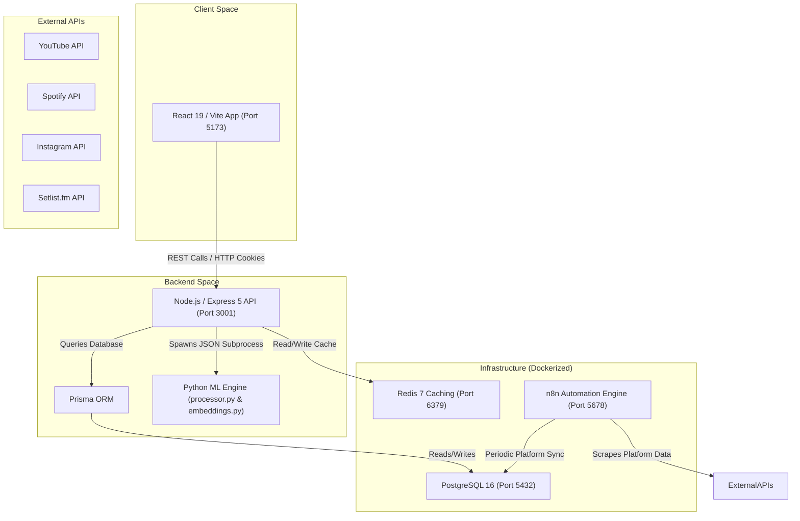

# 🚀 Music Artist Dashboard (MAD) - Setup & Onboarding Guide

Welcome to the **Music Artist Dashboard (MAD)** project! This guide is designed to help you set up the entire full-stack application on your local machine from scratch. 

The dashboard tracks music artist performance, social/streaming platform metrics, concert analytics, and predicts revenues using an integrated Python-based Machine Learning (ML) engine.

---

## 🏢 System Architecture Overview

The application is structured as a full-stack system with a React SPA frontend, an Express REST API backend, and auxiliary caching, database, automation, and machine learning components.



---

## 📋 System Requirements (Prerequisites)

Before you begin, please ensure you have the following installed on your system:

| Tool | Recommended Version | Purpose |
| :--- | :--- | :--- |
| **Node.js** | `v20.0.0` or higher | Runs frontend and backend API servers |
| **npm** | `v10.0.0` or higher | Package management |
| **Docker Desktop** | Latest | Runs PostgreSQL, Redis, and n8n services in containers |
| **Python** | `v3.10` to `v3.12` | Runs the ML engine (`sentence-transformers` & heuristics) |
| **Git** | Latest | Version control |

> [!IMPORTANT]
> **Docker Desktop Settings**:
> Go to *Settings → Resources* in Docker Desktop and verify that it has at least **4 CPUs** and **8GB of RAM** allocated. Running n8n alongside PostgreSQL and Redis can be resource-intensive.

---

## 🛠️ Step-by-Step Installation

Follow these steps in order to set up your environment.

### 1️⃣ Clone the Repository & Install Dependencies
Clone the repository to your machine, then run the root convenience script to install all Node.js dependencies for both the React frontend and Express backend:

```bash
# Clone the repository (if you haven't already)
git clone <repository-url>
cd Dashboard-main

# Install frontend and backend dependencies in one command
npm run install:all
```

*This installs the root dependencies (Vite, React, Tailwind CSS) and automatically cascades into the `backend/` directory to run `npm install` for Express, Prisma, and TypeScript.*

---

### 2️⃣ Configure Backend Environment Variables
Create the backend environment file from the provided template:

```bash
cd backend
cp .env.example .env
```

Open `backend/.env` in your editor and configure the following parameters:
- **`JWT_SECRET` & `JWT_REFRESH_SECRET`**: In development, you can keep the defaults, but update them with strong, random strings for staging or production.
- **`PYTHON_PATH`**: Point this to the Python executable of the virtual environment you will create in **Step 4** (see below).
- **External API Keys**: Add keys for setlist.fm (`SETLISTFM_API_KEY`), Songkick, Eventbrite, etc., if you plan to run scraping pipelines.

---

### 3️⃣ Spin Up Infrastructure Services (Docker)
We use Docker Compose to run PostgreSQL, Redis, and n8n.

```bash
# Navigate to the backend directory containing docker-compose.yml
cd backend

# Start the services in detached mode
docker-compose up -d postgres redis n8n
```

Verify that the containers are healthy:
```bash
docker-compose ps
```

*You should see `mad-postgres`, `mad-redis`, and `mad-n8n` in a running/healthy state.*

---

### 4️⃣ Setup the Python ML Engine
The backend calls Python scripts to run calculations and generate semantic search embeddings. Set up a virtual environment inside the `backend/ml_engine` directory to keep dependencies isolated:

```bash
# Navigate to the ML engine directory
cd backend/ml_engine

# Create a virtual environment named 'venv'
python -m venv venv

# Activate the virtual environment
# --- For Windows (PowerShell) ---
venv\Scripts\Activate.ps1
# --- For Windows (CMD) ---
venv\Scripts\activate.bat
# --- For macOS / Linux ---
source venv/bin/activate

# Install the required libraries (including sentence-transformers)
pip install -r requirements.txt
```

#### Configure `PYTHON_PATH` in `backend/.env`
To ensure the Express server uses this virtual environment instead of your global system Python, update the `PYTHON_PATH` variable in `backend/.env` to point directly to the virtual environment's executable:

*   **Windows**:
    ```env
    PYTHON_PATH="./ml_engine/venv/Scripts/python"
    ```
*   **macOS / Linux**:
    ```env
    PYTHON_PATH="./ml_engine/venv/bin/python"
    ```

---

### 5️⃣ Initialize and Seed the Database
With PostgreSQL running in Docker, run Prisma migrations to build the tables and seed default mock data (genres, artists like Arijit Singh, and an initial admin account):

```bash
cd backend

# Apply migrations
npx prisma migrate dev --name init

# Seed database with sample data
npm run db:seed
```

> [!TIP]
> You can open **Prisma Studio** (a web GUI for database visualization) at any time by running:
> ```bash
> npx prisma studio
> ```
> This will start a local GUI server at `http://localhost:5555`.

---

### 6️⃣ Setup n8n Ingestion Workflows (Optional)
If you want to sync real data from YouTube, Spotify, and Instagram:
1. Open http://localhost:5678 in your browser.
2. Log in using the default credentials:
   *   **Username**: `admin`
   *   **Password**: `n8nadmin123`
3. Go to **Workflows** → **Import from file**.
4. Import the JSON workflow files found in `backend/ingestion/n8n-workflows/`.
5. Edit the **PostgreSQL Node** in each workflow to ensure it connects with:
   *   **Host**: `postgres` (inside Docker network) or `localhost` (if testing workflows outside Docker)
   *   **Port**: `5432`
   *   **Database / User / Password**: `mad` / `postgres` / `postgres123`
6. Click **Test Connection** and save. Activate the scheduled triggers to run daily.

---

## 🏃 Running the Application

Once setup is complete, you can run the entire application (frontend + backend) simultaneously from the **root directory**:

```bash
# Make sure you are at the project root (Dashboard-main)
npm run dev
```

*This spins up:*
1.  **Vite React Frontend**: http://localhost:5173
2.  **Express Backend API**: http://localhost:3001

The Vite server is configured to proxy all `/api/*` requests to http://localhost:3001, so the frontend connects out-of-the-box.

---

## 🔐 Default Credentials & Port Mappings

### Port Mappings
| Service | Local URL | Port |
| :--- | :--- | :--- |
| **Vite Frontend UI** | http://localhost:5173 | `5173` |
| **Express Backend API** | http://localhost:3001 | `3001` |
| **PostgreSQL Database** | `localhost:5432` | `5432` |
| **Redis Cache** | `localhost:6379` | `6379` |
| **n8n Automation Editor** | http://localhost:5678 | `5678` |
| **Prisma Studio (GUI)** | http://localhost:5555 | `5555` |

### Default Credentials
| Portal / Service | Username / Email | Password | Role |
| :--- | :--- | :--- | :--- |
| **MAD Dashboard (Admin)** | `admin@mad.com` | `admin123` | Full access, Excel uploads, triggers syncs |
| **MAD Dashboard (Viewer)** | `viewer@mad.com` | `viewer123` | Read-only access |
| **n8n Workflows Editor** | `admin` | `n8nadmin123` | Workflow editor |
| **PostgreSQL Database** | `postgres` | `postgres123` | Database Owner (DB Name: `mad`) |

---

## 🧪 Testing and Verification

To verify that the installation succeeded and everything is operational, run these checks:

### 1. Run the Backend Test Suite
The backend contains a robust test suite of 80+ test cases covering controllers, middlewares, validations, and analytics:

```bash
cd backend
npm run test
```

### 2. Test the API Health Endpoint
Run a request to check if the backend is successfully connected to PostgreSQL and Redis:

```bash
curl http://localhost:3001/health
```
**Expected Response:**
```json
{
  "status": "healthy",
  "timestamp": "2026-05-20T14:40:00.000Z",
  "uptime": 182.4,
  "environment": "development"
}
```

---

## 🐛 Troubleshooting

### ❌ PostgreSQL Port Conflict (`5432`)
*   **Issue**: Running Docker Compose gives an error: `bind: address already in use` for `0.0.0.0:5432`.
*   **Solution**: You likely have a local PostgreSQL instance running natively. You can stop it:
    *   *Windows*: Run services.msc, find the `postgresql-x64` service, and stop it.
    *   *macOS*: Run `brew services stop postgresql`.
    *   Alternatively, change the host port mapping in `backend/docker-compose.yml` (e.g., `"5433:5432"`) and update `DATABASE_URL` in `backend/.env`.

### ❌ Python Execution / Module Errors in Node.js
*   **Issue**: The server console logs: `Python process exited with code 1` or warning `ML processor failed, using TypeScript fallback`.
*   **Solution**: 
    1.  Ensure you activated the virtual environment and successfully ran `pip install -r requirements.txt`.
    2.  Check the `PYTHON_PATH` variable in `backend/.env`. It must point directly to the python executable within the venv folder. Ensure there are no surrounding quotes or trailing slashes that might throw off the shell spawn.
    3.  Manually run the script with a mock JSON payload to see the raw error:
        ```bash
        cd backend
        ./ml_engine/venv/Scripts/python ./ml_engine/processor.py "{\"artist_popularity\": 75, \"venue_capacity\": 2000, \"city\": \"Mumbai\"}"
        ```

### ❌ Prisma Client Out of Sync
*   **Issue**: TypeScript errors regarding missing models or fields on the prisma client.
*   **Solution**: Regenerate the Prisma Client using:
    ```bash
    cd backend
    npx prisma generate
    ```

---

Have questions or run into an issue? Raise a ticket in the repo or contact the dev team. Happy coding! 🚀
